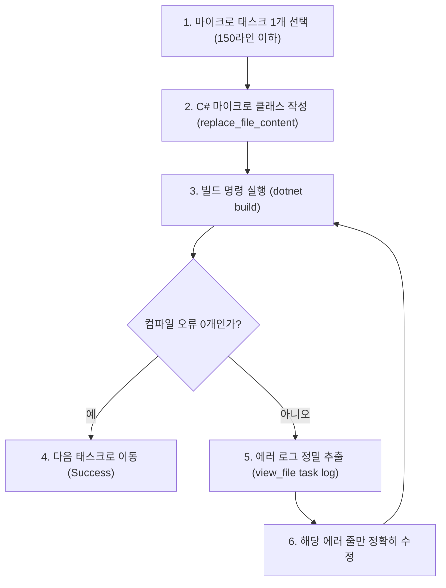

# 🤖 AGENT_BLUEPRINT.md - 소형 LLM 에이전트 구현 청사진 & 개발 가이드라인

> [!IMPORTANT]
> **목적 (Purpose)**  
> Gemini Flash 3.6, Claude Haiku, GPT-4o-mini와 같은 소형/고속 LLM 코딩 에이전트가 복잡한 데이터 허브 기능을 **할루시네이션 없이 100% 컴파일 성공율로 신속하게 구현**할 수 있도록 마이크로 아키텍처 및 원자적 구현 청사진을 정의합니다.

---

## 🎯 1. 소형 LLM 에이전트 핵심 행동 수칙 (Core Rules for Small LLMs)

1. **파일당 150라인 이하 마이크로 모듈화 (Micro-Modular Rule)**:
   - 하나의 파일에 거대한 복합 로직을 구현하지 마십시오. 모든 클래스는 단일 책임 원칙(SRP)에 따라 150라인 이하 전용 파일로 분할합니다.
2. **엄격한 C# 인터페이스 우선 준수 (Strict Interface Contract)**:
   - 구현체를 작성하기 전 `TelemetryDashboard.Core/Interfaces/`에 정의된 C# 인터페이스 시그니처를 100% 정확하게 준수하십시오.
3. **셀프 힐링 컴파일 자가 검증 (Self-Healing Build Loop)**:
   - 코드 작성 또는 수정 후 반드시 `dotnet build` 명령어를 실행하십시오.
   - 빌드 실패 시 추측으로 코드를 고치지 말고, 컴파일 타임 에러 로그 메시지를 정밀 분석하여 해당 에러만 정확히 수정하십시오.

---

## 🏗️ 2. 마이크로 C# 인터페이스 명세서 (Core Interface Contracts)

소형 LLM 에이전트는 아래의 잘 정의된 C# 인터페이스를 전용 구현체 클래스로 신속하게 구현할 수 있습니다:

### 2.1 보안 & 패킷 암호화 인터페이스
```csharp
namespace TelemetryDashboard.Core.Interfaces;

public interface ISecurityProvider
{
    byte[] EncryptPayload(byte[] plainData, byte[] key);
    byte[] DecryptPayload(byte[] encryptedData, byte[] key);
    byte[] SignData(byte[] data, byte[] privateKey);
    bool VerifySignature(byte[] data, byte[] signature, byte[] publicKey);
}
```

### 2.2 플러그인 샌드박스 인터페이스
```csharp
namespace TelemetryDashboard.Core.Interfaces;

public interface IPluginSandbox
{
    void LoadPlugin(string scriptFilePath);
    object ExecuteFilter(string functionName, object telemetryPacket);
    void ReloadAllPlugins();
}
```

### 2.3 이종 프로토콜 브릿지 인터페이스
```csharp
namespace TelemetryDashboard.Core.Interfaces;

public interface IProtocolBridge
{
    string ProtocolName { get; }
    byte[] ConvertToStandardPacket(byte[] rawPayload);
    byte[] ConvertFromStandardPacket(object standardTelemetry);
}
```

---

## 📋 3. 원자적 마이크로 태스크 체크리스트 (Atomic Task Roadmap)

Gemini Flash 3.6 에이전트는 아래의 마이크로 태스크를 **한 번에 딱 하나씩(One Task at a Time)** 순차 실행합니다:

- [ ] **[Task 1] `ISecurityProvider` 인터페이스 및 AES-256 구현체 작성**:
  - `TelemetryDashboard.Core/Services/AesSecurityProvider.cs` 생성 (100라인 이하).
- [ ] **[Task 2] `IPluginSandbox` hot-reloading 스크립트 로더 작성**:
  - `TelemetryDashboard.Core/Services/ScriptPluginSandbox.cs` 생성 (120라인 이하).
- [ ] **[Task 3] `IProtocolBridge` CAN bus & Modbus 변환기 작성**:
  - `TelemetryDashboard.Core/Services/CanBusProtocolBridge.cs` 생성 (110라인 이하).
- [ ] **[Task 4] Gorilla 시계열 델타 비트 압축 로거 작성**:
  - `TelemetryDashboard.Core/Services/GorillaCompressor.cs` 생성 (130라인 이하).
- [ ] **[Task 5] No-Code custom_dashboard.html 템플릿 수출기 작성**:
  - `TelemetryDashboard.Core/Services/DashboardExporter.cs` 생성 (90라인 이하).

---

## 🛠️ 4. 셀프 힐링 빌드 & 검증 프로토콜 (Self-Healing Verification Loop)



---
*작성일자: 2026-08-10 | 작성자: Antigravity AI & User Pair Programming*
