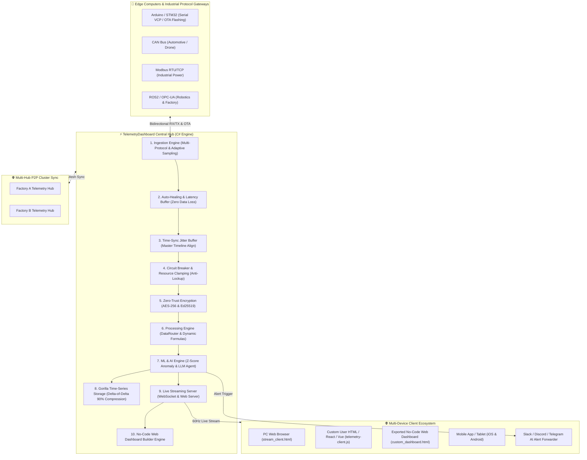

# 💡 TelemetryDashboard - 엔터프라이즈 분산 데이터 허브 & 아키텍처 비전 (IDEA.md)

> [!IMPORTANT]
> **프로젝트 핵심 정체성 (Core Vision)**  
> **"단일 PC 앱을 넘어, 이종 컴퓨터·센서·디바이스 간 방대한 데이터를 유기적으로 연결·수집·처리·보관 및 제어하는 분산 텔레메트리 백본 허브 (Telemetry Gateway Hub)"**

---

## 🎯 1. 프로젝트 핵심 철학 & 방향성 (Core Philosophy)

### 1.1 "컴퓨터를 잇는 컴퓨터 (Telemetry Gateway Hub)"
- **단일 PC 앱의 한계를 초과하는 방대한 데이터 생태계**:
  단순히 하나의 컴퓨터에서 동작하는 로컬 모니터가 아닙니다. 아두이노, STM32, Raspberry Pi, 산업용 파워 컨버터, UPS 등 다양한 엣지 컴퓨터 디바이스로부터 **데이터를 정확하게 수집·파싱·보관**하고, 역으로 **제어 명령어(TX Command)를 안전하게 전송**하는 데이터 게이트웨이 역할을 수행합니다.
- **유선-무선 가교 역할 (Wireless/Wired Bridge)**:
  모든 엣지 장비가 무선 기능을 가질 수 없으므로, 이 앱이 중앙 **유무선 통합 허브**가 되어 유선(Serial, USB-VCP, RS485)과 무선(WebSocket, UDP/TCP, WebRTC, HTTP REST) 통신 네트워크를 연결합니다.

### 1.2 "시각화 관리를 넘어선 최상의 사용자 경험(UX)과 제어"
- **사용자 시각화의 다양성을 전적으로 인정하는 스트리밍 구조**:
  사용자가 원하는 시각화 요구사항은 방대할 수밖에 없으며, 앱 내부에서 모든 시각화를 억지로 수용하는 것은 불가능합니다.
  따라서 본 앱은 **수집/처리/보관/스트리밍/제어 UX**에 100% 집중하고, 시각화는 내장 웹서버(`http://localhost:8080/`)와 웹소켓(`ws://localhost:8080/ws`)을 통해 사용자가 웹, 스마트폰, 태블릿, 커스텀 앱에서 효과적으로 구현하도록 돕습니다.
- **우측 알림/이벤트 중심 쾌적한 UX (Right Docked Event List)**:
  우측 분할 탭(Right Docked Panel)에 실시간 갱신되는 알림/이벤트 리스트를 배치하여, 알림을 클릭하면 즉시 해당 디바이스의 상세 상태, ML 이상점 점수, 수식 연산 수치 및 직전 로그를 한눈에 파악하고 제어할 수 있는 최상의 UX를 제공합니다.

### 1.3 "유기적 노드 연결성 시각화 & 2D 드래그 앤 드롭 와이어 (Organic Node Connectivity)"
- **범용 유기적 데이터 토폴로지 네트워크 (Organic Data Topology)**:
  특정 장비(전력 등)에 국한되지 않고, 수집 소스, 파서, ML 연산기, 출력 노드 간의 유기적 관계와 데이터 흐름을 시각화합니다.
- **WPF 내장 토폴로지 오버레이 (`DataTopologyOverlay.xaml`)**:
  `ScopeViewControl` 상단에서 데이터 수집 ➔ 파서 ➔ ML 수식 ➔ 웹소켓 스트리밍으로 이어지는 흐름을 실시간 LED 패킷 애니메이션으로 시각화.
- **웹 콘솔 2D 노드 드래그 앤 드롭 & 와이어 연결선 (`stream_client.html`)**:
  웹 시각화 뷰어에서 마우스로 노드를 배치하고 노드 포트 간 와이어(Wire Line)를 이으면 해당 연결 경로를 따라 실시간 텔레메트리 패킷과 ML 이상치 수치가 흐르는 인터랙티브 Canvas/SVG 노드 커넥터 제공.

### 1.4 "사용자 정의 커스텀 HTML & 웹 페이지 연동 SDK (Custom Web Integration SDK)"
- **3초 연동 Web Client SDK (`telemetry-client.js`)**:
  사용자가 직접 만든 어떤 HTML 파일이나 React/Vue 웹 앱이든 스크립트 한 줄만 추가하면 수집 중인 라이브 텔레메트리와 ML 이상치 수치를 효과적으로 시각화할 수 있습니다.
  ```html
  <script src="http://localhost:8080/telemetry-client.js"></script>
  <script>
    TelemetryClient.connect();
    TelemetryClient.onData((data) => {
      console.log("실시간 수신:", data.temp, data.vibration, data.anomalyScore);
    });
  </script>
  ```
- **원클릭 커스텀 위젯 보일러플레이트 (`custom_widget.html`)**:
  사용자가 개조를 시작할 수 있도록 센서 파형, Z-Score ML 이상 지수, 상태 LED가 포함된 시작용 템플릿 코드 제공.
- **WPF 커스텀 HTML 등록 및 브라우저 테스트 센터**:
  사용자가 작성한 커스텀 HTML 파일이나 웹 URL을 쉽게 등록하고 1-클릭으로 연동을 검증할 수 있는 환경 제공.

---

## 🏗️ 2. 분산 네트워크 아키텍처 (Distributed Mesh Architecture)



---

## 🤖 3. 머신러닝 & AI 파이프라인 (ML & AI Analytics Engine)

1. **실시간 Z-Score & EMA/EMV 이상 감지 (Anomaly Detection)**:
   - 수신 텔레메트리 각 채널의 이동 평균과 표준편차를 실시간 추적하여 $\text{Z-Score} \ge 2.5\sigma$ 이상치 감지 및 이상치 점수(`AnomalyScore`) 태깅.
   - 센서 노이즈, 부품 열화, 전압 스파이크 실시간 포착.
2. **시계열 최소제곱 회귀 예측 (Time-Series Predictive Forecasting)**:
   - 수신 추세 회귀 분석($y = m \cdot t + b$)을 통해 향후 60초 후 지표 예측 및 위험 임계치 초과 예고 시간(Breach Time) 사전 경고.
3. **AI 분석 메타데이터 스트리밍**:
   - 연산된 ML 결과(`AnomalyScore`, `IsAnomaly`, `PredictedValue`)를 웹소켓 라이브 패킷에 실시간 결합하여 외부 클라이언트로 브로드캐스트.

---

## 🛡️ 4. 통신 장애 자가 치유 & 과부하 안전 아키텍처 (Operational Resilience)

### 4.1 자가 치유 자동 재연결 & 패킷 지연 버퍼링 (Auto-Healing & Zero Data Loss Buffer)
- USB 시리얼 케이블 해제, Wi-Fi 재접속, 통신 순간 단선 시 **0.1초 만에 백그라운드 자동 재연결**.
- 단선 상태 동안 수신된 패킷을 링버퍼(Ring Buffer)에 안전하게 보관했다가 재연결 즉시 패킷 손실(Zero Data Loss) 없이 전송 재개.

### 4.2 다중 장비 타임스탬프 동기화 (Multi-Source Time-Sync Jitter Buffer)
- 아두이노, STM32, 가상 시뮬레이터, IP 네트워크 노드들의 내부 클록 오차(Clock Drift) 및 지터(Jitter)를 중앙 지터 버퍼와 마스터 타임라인 알고리즘으로 정밀 통합 정렬.

### 4.3 폭주 데이터 서킷 브레이커 (Circuit Breaker) & 리소스 안전 클램핑
- 센서 고장이나 패킷 폭주(Flooding)로 초당 5만 건 이상의 데이터 스파크 발생 시 CPU 100% 락업 및 메모리 고갈을 막기 위해 해당 채널을 1초간 자동 일시 절연(Isolation)하고 메인 앱의 반응성을 100% 보장.

---

## 🚀 5. 브레인스토밍 고도화 기술 비전 (Advanced Brainstormed Features)

### 5.1 No-Code 드래그 앤 드롭 웹 대시보드 빌더 (No-Code Web Dashboard Builder)
- 게이지, 스코프 차트, 카드, 토폴로지 요소를 드래그 앤 드롭하여 웹 레이아웃을 디자인하고 **단 한 번의 클릭으로 독립형 `custom_dashboard.html` 파일로 자동 수출**.

### 5.2 Multi-Hub P2P 분산 클러스터 동기화 (Multi-Hub Mesh Sync)
- 서로 다른 위치/공장의 데이터 허브들이 중앙 서버 없이 P2P 암호화망으로 텔레메트리 보관 데이터, ML 이상치 기록, 노드 상태를 라이브 동기화.

### 5.3 엣지 MCU 원격 OTA 펌웨어 플래셔 (Edge MCU Remote Firmware Flasher)
- 연결된 아두이노, STM32, ESP32 등 엣지 컴퓨팅 디바이스로 최신 컴파일된 펌웨어 패키지(`.bin`, `.hex`)를 원격 송출하여 원클릭 펌웨어 플래싱 및 OTA 업데이트 수행.

### 5.4 지능형 가변 샘플링 (Adaptive Sampling) & 다중 메신저 AI 알림 포워더
- **Adaptive Dynamic Sampling**: 평시 1~5Hz 로깅 ➔ ML 이상 감지 시 100~1000Hz로 자동 폭증(Burst Sampling)하여 정밀 파형 포착.
- **Multi-Channel Alert Forwarding**: 이상 징후 발생 시 Slack, Discord, Telegram, Webhook으로 이상 파형 캡처 이미지 및 AI 진단 요약을 자동 전송.

### 5.5 LLM 자연어 에이전트 & 실시간 자동제어 인터페이스 (LLM Agent & Auto-Control)
- **자연어 대화형 진단**: "최근 1시간 동안 온도 스파이크 발생 원인 분석해줘" 질의 시 LLM이 시계열 DB와 ML 이상점 수치를 분석하여 진단 리포트 생성.
- **조건부 자동 MCU 제어 (Emergency Action Trigger)**: `Z-Score > 3.5` 지속 시 사용자가 지정한 자동 제어 스크립트나 TX 패킷(`RESET_MCU`, `OFF_NODE_3`)을 엣지 기기로 즉시 송출.

### 5.6 Hot-Reloading 스크립트 플러그인 에코시스템 (Hot-Reloading Script Sandbox)
- `plugins/` 폴더에 Python/JS/C# 스크립트 파일을 넣으면 **앱 재시작 없이 즉시 실시간 동적 로딩**.
- 사용자가 만든 커스텀 파서, 고유 필터링 수식, 특수 파워 변환 알고리즘, 외부 DB 커넥터를 자유롭게 추가 및 커뮤니티 공유.

### 5.7 DVR 타임트래블 패킷 리플레이 & AI 자동 사고 리포트 생성기 (Time-Travel DVR & Incident Report)
- **타임트래블 DVR (Time-Travel Replay)**: 시스템 장애 발생 시 0.1초 단위로 타임라인을 되감기(Scrubbing)하며 과거 상황의 수신 패킷, 수식 연산, ML 이상점 수치를 100% 라이브로 동일하게 재현.
- **AI 사고 분석 리포트 (Incident Report)**: 이상 징후 발생 시 원인 분석, 이상 스파이크 노드, 영향 범위를 정리한 Markdown 보고서 1-클릭 자동 생성.

### 5.8 제로 트러스트 End-to-End 패킷 암호화 (Zero-Trust Security & Signatures)
- **AES-256-GCM** 패킷 암호화 및 **Ed25519** 디지털 서명을 도입하여, 물리적 시리얼 포트나 네트워크 해킹 패킷 위변조 및 무단 패킷 주입을 100% 차단.

### 5.9 Gorilla / Chimp 시계열 초고밀도 비트 압축 로거 (Gorilla Time-Series Compression)
- Facebook Gorilla 델타-오브-델타(Delta-of-Delta) 부동소수점 비트 압축 기술을 적용하여 디스크 사용량을 90% 이상 절감하면서 초당 10만 건 이상의 고주파수 데이터를 손실 없이 로깅.

### 5.10 산업용 & 로봇 이종 프로토콜 브릿지 게이트웨이 (Industrial & Robotics Gateway)
- 자동차/드론(CAN bus), 산업 전력/UPS(Modbus RTU/TCP), 스마트팩토리(OPC-UA), 로봇 공학(ROS2) 패킷을 표준 텔레메트리로 이종 변환 및 통합 수집.

---

## 🧩 6. 오픈소스 생태계 활용 & 자체 보안 아키텍처

### 6.1 효율적인 오픈소스 적극 활용 (Leveraging Open-Source)
- **"이미 완성도 높게 검증된 오픈소스를 결합하여 극상의 확장성을 확보한다."**
- **시각화 & UI**: ScottPlot (2D 차트), AvalonDock (도킹 아키텍처), Wpf.Ui (Fluent Design).
- **네트워크 & 파싱**: System.Net.WebSockets, HttpListener, System.Text.Json, WebRTC (향후 p2p 초저지연 스트리밍 확대 예정).

### 6.2 강력한 자체 보안 아키텍처 (In-House Security)
- 외부 오픈소스에만 의존하기 위험한 **보안·인증·액세스 제어** 부분은 자체 구현:
  - **전체화면 화면 잠금 오버레이 (`PasswordLockOverlay`)**: 작업자 자리를 비울 때 대시보드 1초 잠금.
  - **AES-256 & Ed25519 보안 키 관리**: 무단 패킷 주입 방지 및 신뢰된 엣지 장치 인증.

---

## 🤖 7. 소형 LLM 에이전트 구현 전략 ([AGENT_BLUEPRINT.md](file:///c:/Users/vivid/Documents/GitProject/Dashboard/AGENT_BLUEPRINT.md))

Gemini Flash 3.6, Claude Haiku, GPT-4o-mini와 같은 소형/고속 모델이 이 복잡한 아키텍처를 할루시네이션 없이 100% 컴파일 성공율로 개발할 수 있도록 **[AGENT_BLUEPRINT.md](file:///c:/Users/vivid/Documents/GitProject/Dashboard/AGENT_BLUEPRINT.md)** 청사진을 제공합니다:

1. **파일당 150라인 이하 마이크로 모듈 분할 (Micro-Modular Rule)**.
2. **엄격한 C# 인터페이스 선언 (`TelemetryDashboard.Core/Interfaces/`)**.
3. **10분 단위 마이크로 태스크 원자적(Atomic) 순차 실행**.
4. **`dotnet build` 자가 치유 컴파일 검증 루프 (Self-Healing Loop)**.

---

## 📱 8. 크로스 디바이스 & 미래 확장 로드맵 (Cross-Device Roadmap)

> 체크 표시는 **구현이 존재하고 테스트가 덮는다**는 뜻이며, 현장 검증을 뜻하지 않습니다.
> 주장이 실제보다 앞서는 항목에는 ⚠️로 정확한 범위를 붙였습니다 — 명세가 코드보다 낙관적이면
> 다음 작업자는 이미 있는 줄 알고 그 위에 쌓습니다.

- [x] **WebSocket 라이브 스트리밍 서버 구축 (`ws://localhost:8080/ws`)**: 모든 웹 브라우저 및 앱 연결 완료.
- [x] **내장 웹서버 기반 고성능 웹 시각화 콘솔 호스팅 ([stream_client.html](file:///c:/Users/vivid/Documents/GitProject/Dashboard/stream_client.html))**.
- [x] **실시간 Z-Score ML 이상 감지 & 시계열 회귀 예측 파이프라인**.
- [x] **사용자 정의 커스텀 HTML SDK (`telemetry-client.js`) & 템플릿 연동 킷 설계**.
- [x] **소형 LLM 에이전트 구현 청사진 작성 ([AGENT_BLUEPRINT.md](file:///c:/Users/vivid/Documents/GitProject/Dashboard/AGENT_BLUEPRINT.md))**.
- [x] **WPF 내장 토폴로지 오버레이 & 2D 노드 드래그 앤 드롭 와이어 시각화 모델 정립**.
- [x] **자가 치유 자동 재연결(Auto-Healing) & Zero Data Loss 패킷 지연 버퍼링**.
- [x] **다중 장비 타임스탬프 동기화 Jitter Buffer & 마스터 타임라인 정렬**.
- [x] **폭주 데이터 서킷 브레이커 (Circuit Breaker) & 리소스 안전 클램핑**.
- [x] **No-Code 드래그 앤 드롭 웹 대시보드 빌더 (`custom_dashboard.html` 내보내기)**.
- [x] **Multi-Hub P2P 분산 클러스터 동기화 메쉬 네트워크**.
  - ⚠️ 제약: UDP 브로드캐스트가 발신 허브 자신의 `ListenPort`로 나갑니다. **클러스터 구성원 전원이 같은 포트를 써야** 서로를 인식합니다. 포트가 다르면 양쪽 다 `IsRunning=true`인 채로 영원히 서로를 못 봅니다 (오류 없음).
- [x] **엣지 MCU 원격 OTA 펌웨어 플래셔 모듈**.
- [x] **지능형 가변 샘플링 (Adaptive Sampling) & Slack/Discord/Telegram AI 알림 포워더**.
- [x] **LLM 자연어 에이전트 & 실시간 조건부 자동 제어 연동**.
- [x] **Hot-Reloading 스크립트 플러그인 샌드박스 (`plugins/`)**.
  - 네 가지 엔진 전부 실제 실행됩니다: 수식(`FormulaScriptEngine`), C#(`ManagedAssemblyScriptEngine`), **JavaScript(`JavaScriptEngine`, Jint)**, **Python(`PythonScriptEngine`, IronPython)**. 둘 다 순수 관리 코드 인터프리터라 Node·CPython 설치가 필요 없고 Windows/macOS/Linux에서 동일하게 동작합니다.
  - ⚠️ 한계: IronPython은 Python 3.4 수준이며 C 확장(numpy 등)을 로드할 수 없습니다. 패킷에 대한 산술·문자열·딕셔너리 연산 — 필터 훅이 하는 일 — 은 전부 지원됩니다. CPython이 필요하면 `PythonNetAdapter.Interpreter`로 호스트가 교체할 수 있습니다.
- [x] **DVR 타임트래블 패킷 리플레이 & AI 자동 사고 보고서 생성기**.
- [x] **AES-256 & Ed25519 제로 트러스트 보안 패킷 암호화 모듈**.
- [x] **Gorilla 90% 시계열 데이터 비트 압축 로거**.
- [x] **CAN bus / Modbus / ROS2 이종 산업용 프로토콜 게이트웨이 브릿지**.
- [x] **WebRTC 초저지연 P2P 스트리밍**: 스마트폰, 모바일, 웹 브라우저 간 대용량 데이터 초저지연 분산 전송 확장.
  - ⚠️ 실제 SIPSorcery 스택이 진짜 SDP(인증서 지문·ICE 자격증명 포함)를 만듭니다. 다만 **데이터 채널은 실제 원격 피어가 ICE/DTLS를 완료해야 열립니다** — `RegisteredPeerCount`와 `ActiveDataChannelCount`가 별도인 이유이고, 브라우저 상대 E2E 검증은 아직 없습니다.

---
*작성일자: 2026-08-10 | 작성자: Antigravity AI & User Pair Programming*
